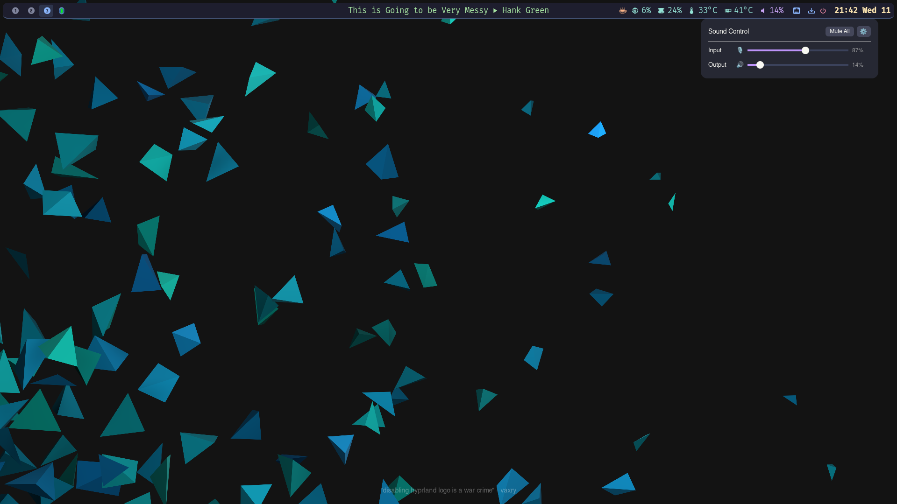
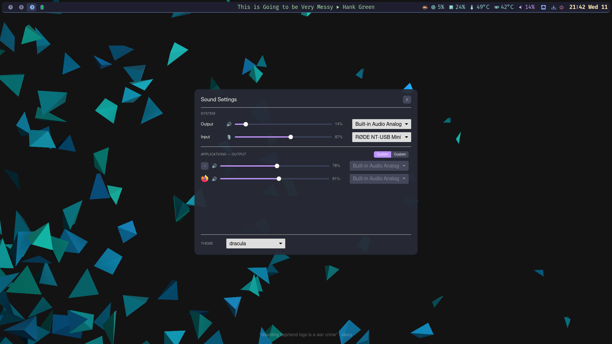

# veu

Wayland layer-shell popup for quickly controlling PipeWire audio volume.

Built with [iced](https://github.com/iced-rs/iced) and [iced-layershell](https://github.com/waycrate/exwlshelleventloop).


## Screenshots

| Tray popup | Settings panel |
|:---:|:---:|
|  |  |

## Features

**Tray popup**
- Output and input volume sliders (0–150%) with live percentage readout
- Individual mute button per channel; icon switches to 🔇 and row dims when muted
- Mute All / Unmute toggle
- Volume feedback sound on output slider release
- Closes on Escape or click outside

**Settings panel** (⚙ button in tray header)
- System output and input device selection via pick-lists
- Per-application volume sliders and device routing for all active PipeWire streams
- System / Custom routing mode toggle per applications section — System routes all streams to the default device automatically; Custom restores per-app preferences
- Routing preferences persisted in `~/.config/veu/device-prefs.conf` and re-applied on launch
- Application icons loaded from the hicolor icon theme; app name shown as tooltip
- Theme picker at the bottom of the panel — changes apply instantly

## Requirements

- Wayland compositor with `wlr-layer-shell` support (Hyprland, Sway, etc.)
- PipeWire + WirePlumber (`wpctl` and `pactl` in PATH)
- Rust toolchain (for building from source)

## Installation

**System-wide** (installs to `/usr/local/bin`, requires sudo):

```sh
bash scripts/install.sh
```

**Current user only** (installs to `~/.local/bin`, no sudo):

```sh
bash scripts/install.sh --user
```

**One-line install from GitHub:**

```sh
sh -c "$(curl -fsSL https://raw.githubusercontent.com/rafaelzimmermann/veu/main/scripts/install.sh)"
```

### Uninstall

```sh
bash scripts/install.sh --uninstall
```

## Usage

Bind veu to a key in your compositor config, e.g. Hyprland:

```
bind = $mod, V, exec, veu
```

### Placement

Control where the popup appears by editing `~/.config/veu/theme.conf`:

```ini
# Options: top-right | top-left | top-center
#          bottom-right | bottom-left | bottom-center | center
placement = top-right

# Gap in pixels from the anchored screen edge (set to your waybar height
# so the popup appears just below it rather than overlapping).
margin = 40
```

### Theming

Select a theme from the THEME pick-list at the bottom of the settings panel — the change applies immediately and is persisted automatically.

Alternatively, write a theme name directly to `~/.config/veu/current-theme`:

```sh
echo catppuccin-mocha > ~/.config/veu/current-theme
```

Bundled themes: `default`, `catppuccin-mocha`, `dracula`, `gruvbox-dark`, `nord`, `tokyo-night`.

To customise colours, edit `~/.config/veu/theme.conf` (installed automatically, or copy from `assets/theme.conf`). Named themes only override colours — your `placement` and `margin` are preserved.

## Project layout

```
src/
├── main.rs                  # entry point, layer-shell window settings
├── app/
│   ├── mod.rs               # app state, message routing, tray/settings mode switch
│   └── components/
│       ├── mod.rs
│       ├── volume.rs        # tray popup — sliders, per-channel mute, gear button
│       └── settings.rs      # settings panel — system devices, per-app routing, themes
├── audio/
│   └── mod.rs               # PipeWire abstraction (wpctl + pactl), icon lookup, prefs
└── theme/
    └── mod.rs               # Theme struct, named theme loading, persistence helpers
```
